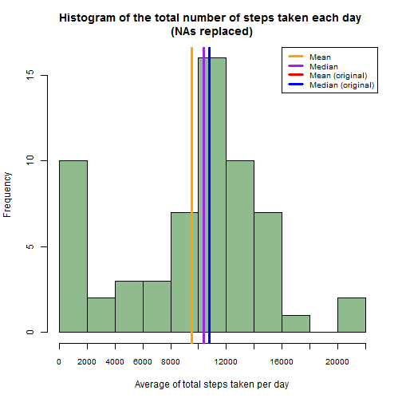
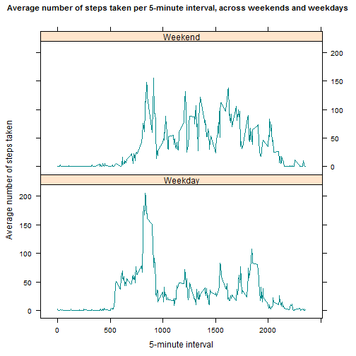

##Loading and preprocessing the data

First we'll start by loading the required packages, which in this case are `lattice` and `knitr`. We must explicitly load `knitr` if we want R Studio to be able to knit the document by pressing the "Knit HTML" button. Otherwise, the code chunk after this one would create errors. This does not mean this document was generated by pressing the button; instead, `knit2html` was used to generate the files.

```r
library(lattice)
library(knitr)
```

Setting global options to always show the code:

```r
opts_chunk$set(echo = TRUE)
```

The following code will unzip the file containing the data set. This code takes into consideration the fact that the zip file in the course project page and the one in GitHub have different names.

```r
if (!file.exists("activiy.csv") & file.exists("repdata_data_activity.zip")){
      unzip("repdata_data_activity.zip")
} 
if (!file.exists("activiy.csv") & file.exists("activity.zip")){
      unzip("activity.zip")
}
```
 
Reading in the extracted data set:

```r
stepdata <- read.csv("activity.csv")
```

Since this data set contains dates, it's important to make sure the locale is set to English.

```r
Sys.setlocale("LC_TIME", "C")
```
<br />  

##What is the mean total number of steps taken per day?

We will start by calculating the total number of steps taken per day. First we use ` tapply` to sum the number of steps per day, then we convert the array to a data frame to be able to manipulate the data more easily. There is no need to print the result since the assignment does not ask for us to report it.

```r
steptotal <- tapply(stepdata$steps, stepdata$date, sum, na.rm = TRUE)
steptotal <- data.frame(date = names(steptotal), total = steptotal, row.names = NULL)
```
 
Having calculated the totals, we can now build the histogram. We will also include the lines for the mean (red) and median (blue).

```r
hist(steptotal$total, breaks = 11, xaxt = "n", col = "darkseagreen", xlab = "Average of total steps taken per day", main =paste("Frequency of total steps taken per day", "\n(NAs removed)"))
axis(1, at = seq(0, 22000, 2000), cex.axis = 0.8)
abline(v = mean(steptotal$total), col = "red", lwd = 3)
abline(v = median(steptotal$total), col = "blue", lwd = 3)
legend("topright", lwd = 3, col = c("red", "blue"), legend = c("Mean", "Median"), cex = 0.8)
```

 

We can see that the mean is smaller than the median and that they're both close to 10 000 steps per day.

```r
mean(steptotal$total)
```

```
## [1] 9354.23
```

```r
median(steptotal$total)
```

```
## [1] 10395
```
<br />  


##What is the average daily activity pattern?

We start by calculating the average of steps taken on a 5 minute interval across all days. Then we convert the array to a data frame to allow for better data manipulation.

```r
stepint <- tapply(stepdata$steps, stepdata$interval, mean, na.rm = TRUE)
stepint <- data.frame(interval = as.integer(as.character(names(stepint))), mean = stepint, row.names = NULL)
```

We can now plot the average number of steps taken in each 5 minute interval:

```r
plot(stepint$interval, stepint$mean, type ="l", lwd =2, col = "darkcyan", xaxt = "n", xlab = "5-minute Interval", ylab = "Average number of steps taken", main=paste("Average number of steps taken in each 5-minute interval", "\n(averaged across all days)"), bty = "n")
axis(1, at = seq(0, 2355, 250), cex.axis= 0.8)
abline(v = stepint[stepint$mean == max(stepint$mean), "interval"], col = "orange", lwd =2, lty = 3)
legend("topright", lwd = 2, col ="orange", legend = c("Maximum"), cex = 0.8, lty = 3)
```

 

We can see where the maximum is on the plot. To get the exact interval and value of the mean for that interval:

```r
stepint[stepint$mean == max(stepint$mean),]
```

```
##     interval     mean
## 104      835 206.1698
```
The 5-minute interval with the maximum number of steps is the 835 interval.
<br />  
<br />  


##Imputing missing values
Number of missing values in the data set:

```r
length(which(is.na(stepdata$steps)))
```

```
## [1] 2304
```

To fill in the missing values, we'll use the median of the respective 5-minute interval. The first step is to calculate the median for each interval using `tapply`, and then converting the array to a data frame.

```r
stepmedian <- tapply(stepdata$steps, stepdata$interval, median, na.rm = TRUE)
stepmedian <- data.frame(interval = names(stepmedian), median = stepmedian, row.names = NULL)
```

We'll copy the original data set and merge the new one with the data frame containing the median for each interval. Since the `merge` function will order the rows by interval, we'll also order the new data set to match the original order.

```r
newstep <- stepdata
newstep <- merge(newstep, stepmedian, by = "interval")
newstep <- newstep[order(newstep$date, newstep$interval),]
rownames(newstep) <- NULL
head(newstep)
```

```
##   interval steps       date median
## 1        0    NA 2012-10-01      0
## 2        5    NA 2012-10-01      0
## 3       10    NA 2012-10-01      0
## 4       15    NA 2012-10-01      0
## 5       20    NA 2012-10-01      0
## 6       25    NA 2012-10-01      0
```

Now that each row has the value for the median of its interval, it's easy to replace the NAs. If the "steps" variable is an NA, its value will be replaced by the median for that interval.

```r
for(i in 1:nrow(newstep)) {
      if(is.na(newstep$steps[i])) {
            newstep$steps[i] <- newstep$median[i]
      }
}
head(newstep)
```

```
##   interval steps       date median
## 1        0     0 2012-10-01      0
## 2        5     0 2012-10-01      0
## 3       10     0 2012-10-01      0
## 4       15     0 2012-10-01      0
## 5       20     0 2012-10-01      0
## 6       25     0 2012-10-01      0
```

Now we can get rid of the median column and organise the order of the columns to match the original order.

```r
newstep <- newstep[, c(2, 3, 1)]
```
<br />  

We'll now calculate the total number of steps taken each day:

```r
newsteptotal <- tapply(newstep$steps, newstep$date, sum)
newsteptotal <- data.frame(date = names(newsteptotal), total = newsteptotal, row.names = NULL)
```

Plotting the histogram of the total number of steps taken per day, including the mean (orange), median (purple), and the mean and median from the original data set (red and blue):

```r
hist(newsteptotal$total, breaks = 11, xaxt = "n", col = "darkseagreen", xlab = "Average of total steps taken per day", main =paste("Frequency of total steps taken per day", "\n(NAs replaced)"))
axis(1, at = seq(0, 22000, 2000), cex.axis = 0.8)
abline(v = mean(newsteptotal$total), col = "orange", lwd = 3)
abline(v = median(newsteptotal$total), col = "purple", lwd = 3)
abline(v = mean(steptotal$total), col = "red", lwd = 3)
abline(v = median(steptotal$total), col = "blue", lwd = 3)
legend("topright", lwd = 3, col = c("orange", "purple", "red", "blue"), legend = c("Mean", "Median", "Mean (original)", "Median (original)"), cex = 0.8)
```

 

Notice the medians overlap, because we used the median of the 5-minute interval to fill in the NAs.
Calculating both original and new mean:

```r
mean(steptotal$total)
```

```
## [1] 9354.23
```

```r
mean(newsteptotal$total)
```

```
## [1] 9503.869
```
The new mean is slightly higher because the NAs values were replaced with the median values for each interval. Assuming the median of each interval follows the same pattern of the median for the total number of steps per day, then the median of each interval is higher than the respective mean (see the mean and median of total steps per day calculated previously for the original data set). This means that the NAs were replaced with values higher than the mean, which would in turn increase the average of the total number of steps taken per day.

As we can see, the median remains the same:

```r
median(steptotal$total)
```

```
## [1] 10395
```

```r
median(newsteptotal$total)
```

```
## [1] 10395
```

Imputing missing data with this particular method slightly increased the mean of total steps taken each day, but the median remained the same. Overall, the change does not seem very significant:

```r
percent <- (mean(newsteptotal$total) - mean(steptotal$total)) / mean(steptotal$total)
percent
```

```
## [1] 0.01599697
```
As we can see, the mean only increased by 1.6%.
<br />  
<br />  


##Are there differences in activity patterns between weekdays and weekends?

The first step is turning the date column to a "Date" object. Then we create a new column with the weekdays of the respective observations. Once that is done, we replace "Sat" and "Sun" (Saturday and Sunday) with "weekend", and the remaining with "weekday". Then we convert this column to a factor variable. The last step is calculating the mean of the steps by both interval and type of day (weekend or weekday). 

```r
newstep$date <- as.Date(newstep$date)
newstep$day <- weekdays(newstep$date, abbreviate = TRUE)
for(i in 1:nrow(newstep)) {
      if(newstep$day[i] == "Sat" | newstep$day[i] == "Sun") {
            newstep$day[i] <- "weekend"
      } else {
            newstep$day[i] <- "weekday"
      }
}
newstep$day <- as.factor(newstep$day)
head(newstep)
```

```
##   steps       date interval     day
## 1     0 2012-10-01        0 weekday
## 2     0 2012-10-01        5 weekday
## 3     0 2012-10-01       10 weekday
## 4     0 2012-10-01       15 weekday
## 5     0 2012-10-01       20 weekday
## 6     0 2012-10-01       25 weekday
```

```r
weekmean <- aggregate(steps ~ interval + day, data = newstep, mean)
```

Using the `lattice` package, we'll plot the average number of steps averaged across weekday days and weekend days, along the 5-minute interval.

```r
xyplot(steps ~ interval | day, data = replace(weekmean, "day", structure(weekmean$day, levels = c("Weekday", "Weekend"))), type = "l", layout = c(1, 2), xlab = "5-minute interval", ylab = "Average number of steps taken", main= "Average of steps taken in each 5-minute interval, across weekends and weekdays", par.settings=list(par.main.text=list(cex=0.9)), col = "darkcyan", lwd = 1.5)
```

 

This suggests the subject wakes up and goes to bed earlier during the weekdays, while waking up and going to bed at later hours during the weekend. 
During the weekday, apart from the initial spike where the subject is probably going to work, the number of steps is lower than the number of steps on the weekend, for the same time frame.
